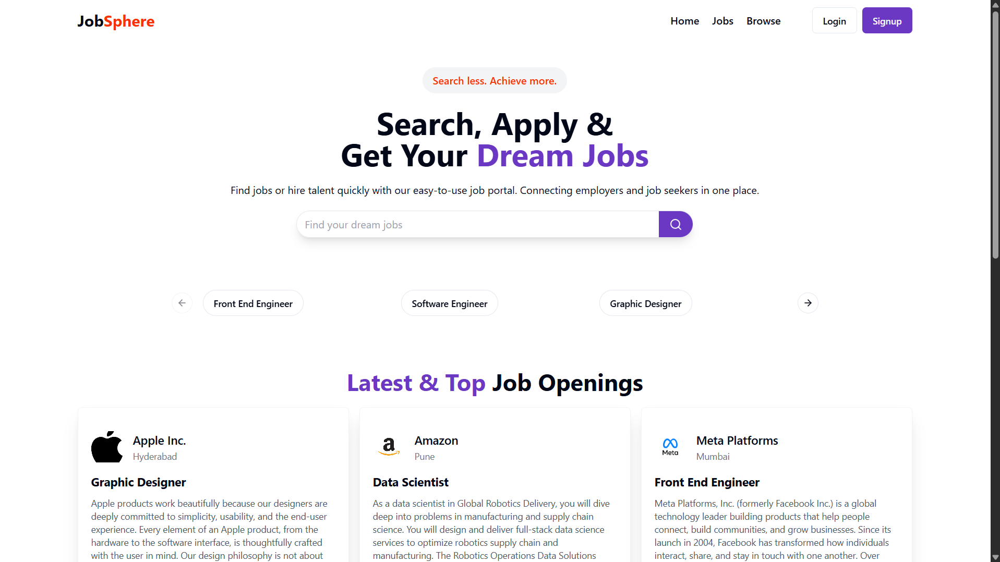
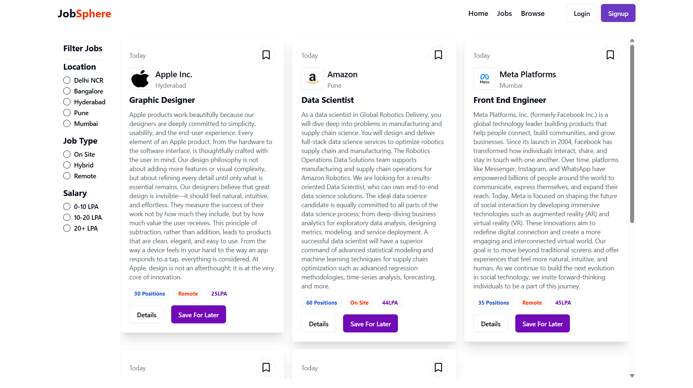
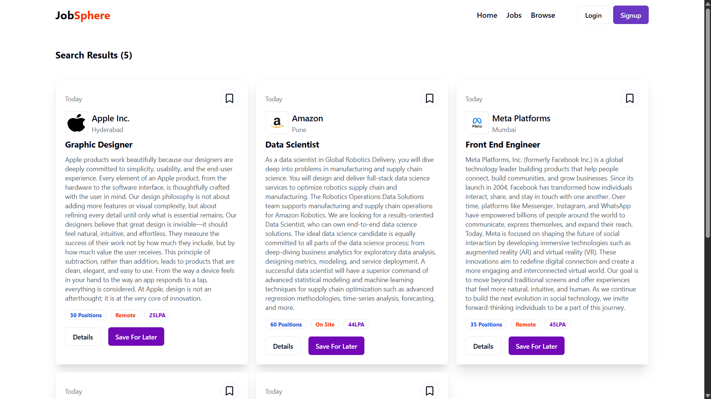
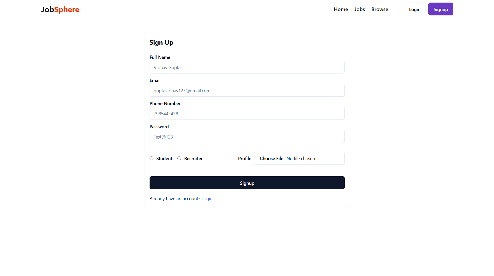
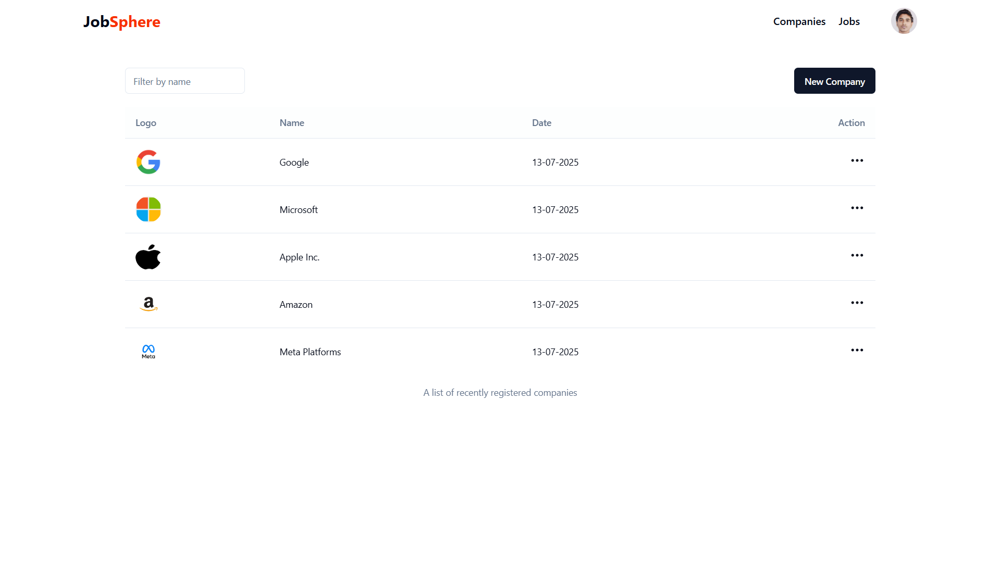

# 💼 Job-Sphere : A Fullstack Job Portal with Admin Dashboard

A modern, end-to-end **Job Portal Web Application** built using the powerful **MERN Stack (MongoDB, Express, React, Node.js)**. It supports job seekers and recruiters with real-time applications, secure authentication, file uploads, admin dashboard, and more — designed with a responsive and sleek UI using **ShadCN UI**.


---

## 📸 App Snapshots

<p align="center">
  
  <br/><em>🏠 Homepage with dynamic latest job listings</em><br/><br/>

  
  <br/><em>🔍 Filter jobs by location, type, and salary</em><br/><br/>

  
  <br/><em>📄 List of available jobs for users to explore</em><br/><br/>

  
  <br/><em>📄 Detailed Job Description with Apply button</em><br/><br/>

  
  <br/><em>🔐 Secure signup for users and recruiters</em><br/><br/>

  
  <br/><em>🛠️ Admin Dashboard to manage companies, jobs, and applicants</em><br/><br/>
</p>

---

## 🔥 Features

### 👨‍💻 For Job Seekers
- Register & login with secure JWT-based authentication
- Browse & filter jobs
- Apply to jobs with resume upload (Multer support)
- Track application status
- Update profile and resume

### 🏢 For Recruiters (Admin)
- Company registration and admin access
- Global job and user management
- Create, edit and delete job posts & companies
- View applicants & update application status

---

## 🛠️ Tech Stack

### Frontend
- ⚛️ ReactJS
- 💅 ShadCN UI (Tailwind + Radix UI)
- 🧠 Redux Toolkit

### Backend
- 🟢 Node.js + Express.js
- 🗄️ MongoDB + Mongoose
- 🔐 JWT + Middleware Auth
- 📂 Multer for Resume/File Uploads

---

## 📁 Folder Structure

```
fullstack-job-portal/
├── backend/                    # Express.js backend
│   ├── index.js               # Entry point
│   ├── .env                   # Environment variables
│   ├── package.json           # Backend dependencies
│   ├── controllers/           # Route logic
│   │   ├── application.controller.js
│   │   ├── company.controller.js
│   │   ├── job.controller.js
│   │   └── user.controller.js
│   ├── models/                # Mongoose models
│   │   ├── application.model.js
│   │   ├── company.model.js
│   │   ├── job.model.js
│   │   └── user.model.js
│   ├── middlewares/          # Auth and upload middleware
│   │   ├── isAuthenticated.js
│   │   └── mutler.js
│   ├── routes/                # API routes
│   │   ├── application.route.js
│   │   ├── company.route.js
│   │   ├── job.route.js
│   │   └── user.route.js
│   └── utils/                 # Helper utilities
│       ├── cloudinary.js
│       ├── datauri.js
│       └── db.js

├── frontend/                  # React + Vite frontend
│   ├── index.html             # HTML entry point
│   ├── package.json           # Frontend dependencies
│   ├── vite.config.js         # Vite config
│   ├── tailwind.config.js     # Tailwind CSS config
│   ├── postcss.config.js      # PostCSS config
│   ├── jsconfig.json          # JS config for paths
│   ├── components.json        # Component metadata (ShadCN)
│   └── src/                   # React application code
│       ├── app/               # Redux store setup
│       ├── pages/             # Route components (Home, Jobs, Auth, etc.)
│       ├── components/        # Reusable components (Navbar, JobCard, etc.)
│       ├── shared/            # Layout parts (Sidebar, Footer, etc.)
│       ├── features/          # Redux slices (authSlice, jobSlice, etc.)
│       ├── services/          # API service calls
│       ├── utils/             # Helper functions
│       └── main.jsx           # App entry point

├── screenshots/               # Images for README preview
├── README.md                  # Project documentation
└── LICENSE                    # MIT License
```


---

## 🚀 Getting Started

### 1️⃣ Clone the Repository

```bash
git clone https://github.com/vibhav30/job-sphere.git
cd job-sphere
```

### 2️⃣ Install Dependencies

**Backend:**

```bash
cd server
npm install
```

**Frontend:**

```bash
cd ../client
npm install
```

---

## 🔧 Configuration

Create a `.env` file inside the `server` folder:

```env
PORT=8000
MONGO_URI=your_mongodb_connection_string
SECRET_KEY=your_jwt_secret
CLOUD_NAME=your_cloudinary_cloud_name
API_KEY=your_cloudinary_api_key
API_SECRET=your_cloudinary_api_secret
```

---

## ▶️ Running the App

### Start Backend

```bash
cd server
npm run dev
```

### Start Frontend

```bash
cd client
npm run dev
```

Frontend runs at: `http://localhost:5173`  
Backend runs at: `http://localhost:8000`

---

## 🙌 Contributing

Contributions are what make the open-source community such an amazing place to learn and grow. Feel free to fork the project and open a pull request.

1. Fork the project  
2. Create your feature branch (`git checkout -b feature/AmazingFeature`)  
3. Commit your changes (`git commit -m 'Add some AmazingFeature'`)  
4. Push to the branch (`git push origin feature/AmazingFeature`)  
5. Open a Pull Request  

---

## 🪪 License

Distributed under the MIT License. See `LICENSE` for more information.

---

## 📬 Contact

**Created by Vibhav Gupta**  
Email: [guptavibhav123@gmail.com]  
GitHub: [https://github.com/vibhav30](https://github.com/vibhav30)
